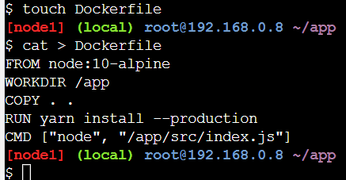
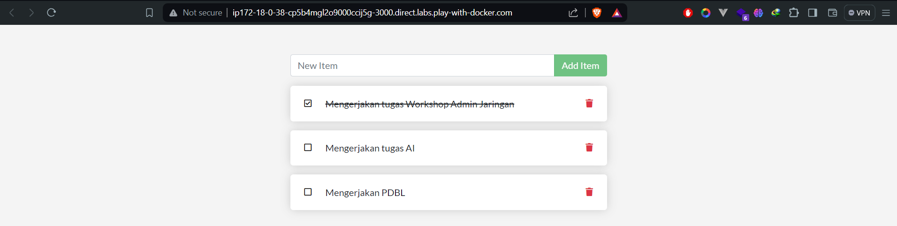
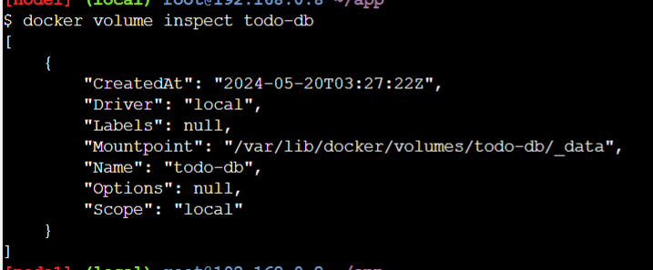

# Docker Playground

## Getting Started
1. Login ke https://labs.play-with-docker.com/.
2. Klik add new instance. Akan ada terminal yang muncul.


3. Jalankan `docker run -dp 80:80 docker/getting-started:pwd` di terminalnya.


4. Setelah dijalankan, akan muncul port 80. Klik port tersebut.


5. Kita akan diarahkan ke port 80 yang kita jalankan tadi. Isinya adalah tutorial docker. Karena tadi di terminal, kita menggunakan image `docker/getting-started`. Di situ dijelaskan bagaimana cara kerja command yang dijalankan tadi.


## Our Application

1. Lalu pada sidebarnya, klik `Our Application`. Kita akan mengikuti langkah-langkah yang ada di situ. Di situ kita akan membuat website to-do-list yang berjalan di Node. Tapi di sini kita tidak membuat codingnya, karena source code sudah disediakan di http://ip172-18-0-38-cp5b4mgl2o9000ccij5g-80.direct.labs.play-with-docker.com/assets/app.zip.


2. Download app.zip dan drag-and-drop file tersebut ke terminal untuk mengupload filenya.


3. Extract filenya dengan `unzip app.zip`.


4. Navigasikan direktori ke `app` dan cek file apa saja yang ada di direktori tersebut. Bisa dilihat bahwa sudah ada folder dan file yang sesuai dengan aplikasi Node.


5. Buat file bernama `Dockerfile` dengan konten:
```
FROM node:10-alpine
WORKDIR /app
COPY . .
RUN yarn install --production
CMD ["node", "/app/src/index.js"]
```
Jalankan `touch Dockerfile` untuk membuat filenya. Lalu ubah kontennya menggunakan vi atau cat, di sini saya menggunakan cat.



6. Build container imagenya dengan `docker build -t docker-101 .`.


7. Jalankan containernya dengan `docker run -dp 3000:3000 docker-101`. Di sini kita membuat map antara port 3000 milik host dan port 3000 milik container.


8. Klik port 3000 di atas dan kita berhasil membuat aplikasi to-do-list berbasis Node serta menjalankannya di container docker.


## Updating Our App

1. Pada line 56 di `~/app/src/static/js/app.js`. Ubah jadi seperti ini:
```
-                <p className="text-center">No items yet! Add one above!</p>
+                <p className="text-center">You have no todo items yet! Add one above!</p>
```

Kita bisa memanfaatkan Editor yang ada di Docker Playground untuk memudahkan edit file. Jangan lupa setelah mengubah, klik Save.


2. Lalu build versi terbaru dari imagenya dengan command yang sama `docker build -t docker-101 .`.


3. Jalankan container baru dengan code yang sudah diubah tadi `docker run -dp 3000:3000 docker-101`. Nah, akan ada error. 


4. Cek ID containernya dengan `docker ps`.


5. Gunakan `docker stop <container-id>` untuk menghentikan container.


6. Sekarang kita bisa update app kita dengan `docker run -dp 3000:3000 docker-101`.


7. Klik port 3000 lalu kita bisa melihat perubahan yang kita buat tadi.


## Sharing Our App
1. Login dulu di https://hub.docker.com/.
2. Klik Create a Repository.


3. Repositorynya diberi nama `101-todo-app` dan pastikan Visibilitynya di-set ke Public. Lalu klik Create. Di bagian kanan kita juga bisa melihat cara untuk push ke repo ini `docker push algavania/101-todo-app:tagname`.


4. Kembali ke PWD Instance atau terminal Dockernya dan jalankan `docker push algavania/101-todo-app`.


5. Ternyata terjadi error, untuk fix error tersebut maka kita harus memberikan tag ke image kita, atau memberi nama lain.

6. Login ke Docker Hub dengan command `docker login -u YOUR-USER-NAME`. Gunakan command `docker tag` untuk memberi nama baru kepada image `docker-101`.


7. Kita coba push image kita lagi dengan `docker push algavania/101-todo-app` dan ternyata berhasil.


8. Kembali ke PWD lalu klik "Add New Instance".


9. Lalu jalankan `docker run -dp 3000:3000 YOUR-USER-NAME/101-todo-app`.


10. Buka port 3000 dan kita bisa melihat web to-do-list kita.


## Persisting Our DB
1. Buat container ubuntu yang akan membuat file bernama `/data.txt` dengan angka random dari 1 hingga 10000 dengan command `docker run -d ubuntu bash -c "shuf -i 1-10000 -n 1 -o /data.txt && tail -f /dev/null"`.


2. Validasi outputnya dengan cara `docker exec <container-id> cat /data.txt`.


3. Sekarang kita coba jalankan container ubuntu yang lain (dengan image yang sama) dan kita akan lihat apakah kita punya file yang sama dengan container ubuntu sebelumnya. Terlihat bahwa tidak ada file `data.txt`.


4. Lalu kita hapus container ubuntu pertama kita tadi dengan `docker rm -f CONTAINER-ID`.


5. Buat volume dengan `docker volume create todo-db`.

6. Jalankan todo container dan tambahan flag `-v` untuk specify volume mount.


7. Kita coba tambahkan beberapa item di aplikasi to-do-list.


8. Hapus container todo appnya dengan `docker rm -f <id>`.


9. Jalankan container baru dengan command `docker run -dp 3000:3000 -v todo-db:/etc/todos docker-101`. Lalu open port 3000. Terlihat bahwa data yang kita inputkan tadi masih ada. Ini berarti datanya berhasil menjadi persistent.



10. Jika ingin mengetahui di mana Docker menyimpan data kita jika menggunakan named volume, kita bisa menggunakan `docker volume inspect <name>`.



## Using Bind Mounts
1. Pastikan bahwa kita tidak mempunyai container `docker-101` yang masih berjalan.


2. Jalankan command berikut:
```
docker run -dp 3000:3000 \
    -w /app -v $PWD:/app \
    node:10-alpine \
    sh -c "yarn install && yarn run dev"
```


3. Jalankan `docker logs -f <container-id>`, jika bisa `Listening on port 3000` maka sudah bisa digunakan.


4. Kita ubah tombol "Add Item" menjadi "Add" di `src/static/js/app.js`. 


5. Jalankan port 3000 dan kita bisa melihat bahwa tombol sudah berubah menjadi "Add".


6. Kita bisa bebas membuat perubahan sesuka kita. Jika sudah selesai, stop containernya dan build imagenya dengan `docker build -t docker-101 .`.

## Multi-Container Apps
1. Buat networknya dengan `docker network create todo-app`.


2. Jalankan MySQL container dan attach ke network. Jalankan command:
```
docker run -d \
    --network todo-app --network-alias mysql \
    -v todo-mysql-data:/var/lib/mysql \
    -e MYSQL_ROOT_PASSWORD=secret \
    -e MYSQL_DATABASE=todos \
    mysql:5.7
```


3. Jalankan `docker exec -it <mysql-container-id> mysql -p` untuk mengonfirmasi bahwa database kita sudah berjalan.


4. Cek database yang tersedia dengan menjalankan `SHOW DATABASES;`.


5. Jalankan container baru dengan `docker run -it --network todo-app nicolaka/netshoot`.
6. Jalankan `dig mysql` untuk mendapatkan IP address.


7. Jalankan command berikut untuk specify environment variables dan connect ke container.
```
docker run -dp 3000:3000 \
  -w /app -v $PWD:/app \
  --network todo-app \
  -e MYSQL_HOST=mysql \
  -e MYSQL_USER=root \
  -e MYSQL_PASSWORD=secret \
  -e MYSQL_DB=todos \
  node:10-alpine \
  sh -c "yarn install && yarn run dev"
```


8. Kita cek lognya dengan `docker logs <container-id>`. Nanti akan ada message yang memberitahu bahwa sedang menggunakan database mysql.


9. Buka web to-do-listnya di port 3000 dan tambahkan beberapa item.


10. Lalu connect ke mysql databasenya dengan `docker exec -ti <mysql-container-id> mysql -p todos`. Lalu jalankan `select * from todo_items;`. Terlihat bahwa aplikasi kita berhasil connect ke database mysql.


## Using Docker Compose
1. Karena kita menggunakan Play-with-Docker instance, maka Docker Compose sudah ter-install. Kita cek versinya dengan `docker-compose version`.


2. Di folder `app`, buat file bernama `docker-compose.yml`.

3. Lalu isikan filenya seperti ini.


4. Pertama, mari kita definisikan service entry dan image untuk container. Kita bisa memilih nama apa saja untuk service tersebut. Nama ini secara otomatis akan menjadi alias jaringan, yang akan berguna saat mendefinisikan service MySQL kita.

Biasanya, perintah ditempatkan dekat dengan definisi image, meskipun tidak ada persyaratan khusus untuk urutannya. Jadi, mari kita pindahkan itu ke dalam file kita.

Mari kita migrasi bagian -p 3000:3000 dengan mendefinisikan ports untuk service.

Selanjutnya, kita akan migrasi direktori (-w /app) dan mapping volume (-v $PWD:/app) menggunakan definisi working_dir dan volumes.

Salah satu keuntungan dari volume Docker Compose adalah kita bisa menggunakan jalur relatif dari direktori saat ini.

Terakhir, kita perlu migrasi definisi environment variables menggunakan key environment.

File docker-compose.yml akan menjadi seperti ini.


5. Pertama, kita akan mendefinisikan layanan baru dan menamainya mysql sehingga secara otomatis mendapatkan alias jaringan. Kita juga akan menentukan image yang akan digunakan.

Selanjutnya, kita akan mendefinisikan pemetaan volume. Saat kita menjalankan container dengan docker run, volume bernama dibuat secara otomatis. Namun, itu tidak terjadi saat menjalankan dengan Compose. Kita perlu mendefinisikan volume di bagian top-level volumes: dan kemudian menentukan mountpoint dalam konfigurasi layanan. Dengan hanya menyediakan nama volume, opsi default akan digunakan. Namun, tersedia banyak opsi lain.

Terakhir, kita hanya perlu menentukan environment variables.

File docker-compose.yml akan menjadi seperti ini.


6. File docker-compose.yml sudah siap digunakan.


7. Jalankan `docker-compose up -d`.


8. Mari kita lihat log menggunakan perintah docker-compose logs -f. Kita akan melihat log dari masing-masing layanan terjalin menjadi satu stream. Ini sangat berguna saat kita ingin memantau masalah terkait waktu. Flag -f "mengikuti" log, sehingga memberikan output langsung saat log dihasilkan.


9. Lalu kita harusnya sudah bisa membuka aplikasi to-do-listnya lagi.


10. Jika ingin menghentikan docker compose, gunakan command `docker-compose down`.

## Image Building Best Practices
### Image Layering
1. Gunakan `docker image history` untuk melihat layer-layer di image `docker-101`. Setiap baris mewakili sebuah layer dalam image. Tampilan di sini menunjukkan layer dasar di bagian bawah dengan layer terbaru di bagian atas. Dengan ini, kita juga dapat dengan cepat melihat ukuran setiap layer, membantu mendiagnosis image yang besar.


2. Jalankan `docker image history --no-trunc docker-101`. Kita akan melihat bahwa beberapa baris terpotong. Jika kita menambahkan flag --no-trunc, kita akan mendapatkan output lengkap.


### Layer Caching
1. Ubah Dockerfile menjadi seperti ini.


2. Build image baru dengan `docker build -t docker-101 .`.

3. Ubah title di `src/static/index.html` menjadi "The Awesome Todo App".


4. Build lagi imagenya dengan `docker build -t docker-101 .`. Buildnya akan menjadi lebih cepat karena menggunakan cache.
