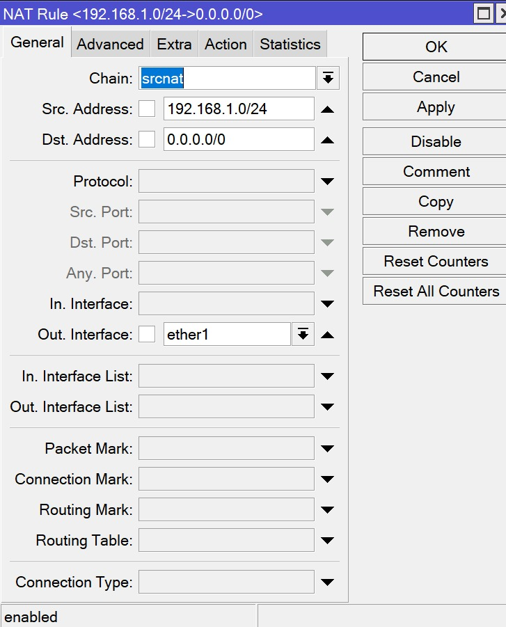
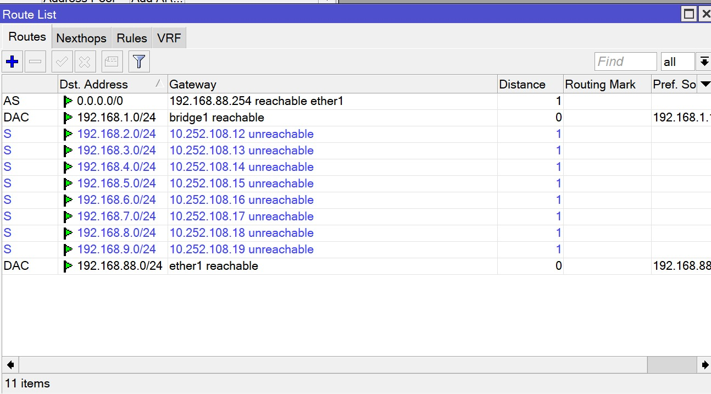
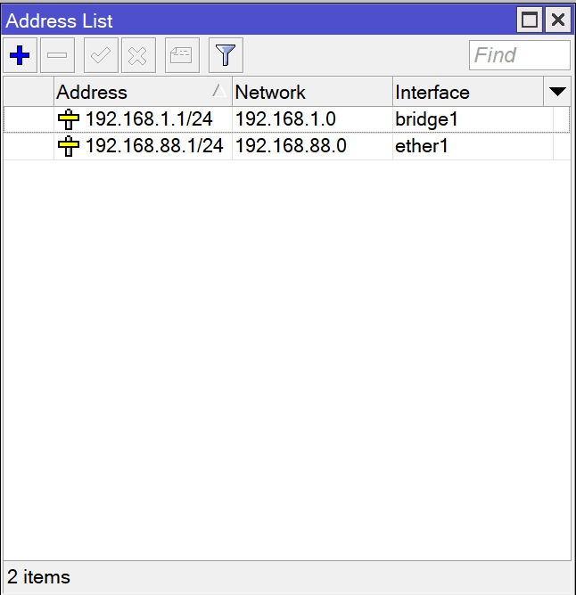
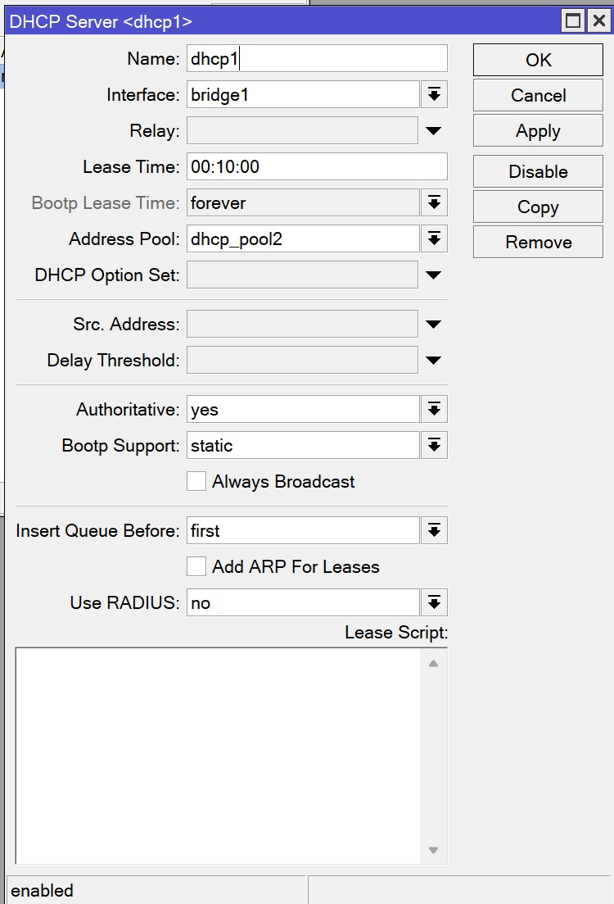
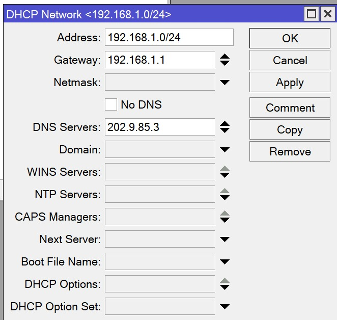

# Week 3

## Table of Contents

- [Week 3](#week-3)
  - [Table of Contents](#table-of-contents)
  - [Bagaimana Internet Bekerja?](#bagaimana-internet-bekerja)
  - [Setting Mikrotik](#setting-mikrotik)
    - [NAT pada firewall:](#nat-pada-firewall)
    - [Address list](#address-list)
    - [Routing untuk terhubung ke internet](#routing-untuk-terhubung-ke-internet)

## Bagaimana Internet Bekerja?
Internet adalah jaringan global yang terdiri dari jutaan perangkat yang terhubung secara fisik melalui kabel serat optik, kabel tembaga, satelit, dan teknologi nirkabel lainnya. Proses kerja Internet melibatkan beberapa tahapan yang kompleks, di antaranya:

1. **Perangkat Pengguna**: Pengguna mengakses Internet melalui perangkat seperti komputer, smartphone, tablet, dan perangkat lainnya. Perangkat ini terhubung ke jaringan melalui penyedia layanan internet, baik melalui koneksi kabel maupun nirkabel.

2. **Protokol Komunikasi**: Internet menggunakan serangkaian protokol komunikasi, terutama TCP/IP, yang mengatur bagaimana data dikirim, diterima, dan diproses di seluruh jaringan. TCP (Transmission Control Protocol) memastikan pengiriman data yang andal, sedangkan IP (Internet Protocol) mengatur pengalamatan dan routing data.

3. **Routing**: Data yang dikirim melalui Internet melewati serangkaian perangkat jaringan yang disebut router. Router bertanggung jawab untuk mengarahkan data ke tujuan yang tepat melalui jalur yang optimal. Proses routing ini memastikan data mencapai tujuannya dengan efisien.

4. **Domain Name System (DNS)**: DNS adalah sistem yang menerjemahkan nama domain yang mudah diingat (seperti www.example.com) menjadi alamat IP yang diperlukan untuk mengidentifikasi tujuan komunikasi. Ini memungkinkan pengguna untuk mengakses situs web dan layanan online dengan menggunakan nama domain alih-alih harus mengingat alamat IP yang rumit.

5. **Server**: Ketika pengguna mengakses konten di internet, permintaan tersebut dikirim ke server yang menyimpan konten tersebut. Server merespons permintaan tersebut dengan mengirimkan data kembali ke perangkat pengguna. Ada berbagai jenis server, termasuk server web, server email, server file, dan lainnya.

6. **Penyedia Layanan Internet (ISP)**: ISP adalah perusahaan yang menyediakan akses ke Internet. Mereka menghubungkan pengguna ke jaringan Internet dan menyediakan layanan seperti koneksi internet, hosting website, layanan email, dan lainnya. ISP juga bertanggung jawab untuk mengelola lalu lintas data antara pengguna dan internet secara keseluruhan.

Dengan kerjasama antara semua komponen ini, data dapat dikirimkan dengan cepat dan efisien di seluruh dunia, memungkinkan pengguna untuk mengakses informasi, berkomunikasi, dan berbagi konten secara global. Internet terus berkembang dan menjadi bagian integral dari kehidupan modern, memungkinkan terciptanya ekosistem digital yang luas dan terhubung.

## Setting Mikrotik
### NAT pada firewall:
  
* Action: masquerade
* Chain: srcnat
* Source Address: 192.168.1.0/24
* Destination Address: 0.0.0.0/0
* Out Interface: ether1 

### Address list
* Tambahkan Route untuk Ether1 : 0.0.0.0/0 192.168.88.254 ether1  
  

* 192.168.1.1/24 untuk 192.168.1.0 pada bridge1
* 192.168.88.1/24 untuk 192.168.88.0 pada ether1

### Routing untuk terhubung ke internet
  

* DNS server pada DHCP: 202.9.85.3
  
 