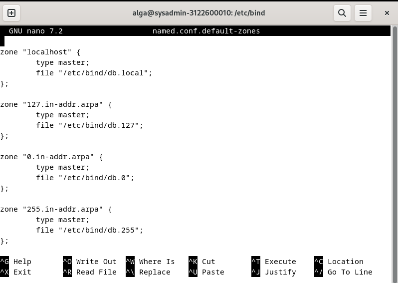

# Week 5
## Table of Contents

- [Week 5](#week-5)
  - [Table of Contents](#table-of-contents)
  - [Bind9](#bind9)

## Bind9
1. Install bind9 melalui terminal.

2. Cek file-filenya di /etc/bind.

3. Buka konfigurasi di named.conf dan sesuaikan konfigurasi seperti di gambar.

4. Buka konfigurasi di named.conf.default-zones dan sesuaikan konfigurasi seperti di gambar.

5. Buka konfigurasi di named.conf.options dan sesuaikan konfigurasi seperti di gambar. Di listen-on, sesuaikan dengan kelompok masing-masing.

6. Buka konfigurasi di named.conf.local dan sesuaikan zone dengan kelompok masing-masing.

7. Lakukan pengecekan konfigurasi dengan sudo named-checkconf. Jika tidak ada error, maka konfigurasi sudah benar.

8. Navigasi ke /var/lib/bind lalu konfigurasikan db.kelompok1.local seperti di gambar.

9. Konfigurasikan juga db.kelompok1.local.inv

10. Jalankan sudo systemctl restart named.
11. Jalankan perintah dig.
  

12. Jalankan perintah nslookup.

