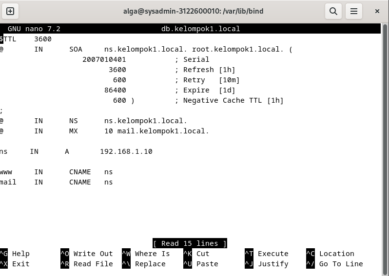

# Week 7

## Table of Contents

- [Week 7](#week-7)
  - [Table of Contents](#table-of-contents)
  - [Mail Server](#mail-server)
    - [Roundcube](#roundcube)

## Mail Server
1. Konfigurasi db.kelompok1.local.

2. Konfigurasi db.kelompok1.local.inv.

3. Jalankan nslookup mail.kelompok1.local.

4. Install systemd-timesyncd untuk Network Time Protocol.

5. Set timezone ke Jakarta, ntp true, dan local rtc false.

6. Konfigurasi file timesyncd.conf di /etc/systemd dan ubah pool menjadi yang paling dekat agar delaynya pendek.

7. Restart service dan cek statusnya.

8. Cek tanggalnya.

9. Install Apache 2.

10. Ubah ServerTokens menjadi Prod.

11. Tambahkan ServerName sesuai kelompok.

12. Ubah ServerAdmin sesuai kleompok.

13. Reload Apache.

14. Cek apakah webserver berhasil berjalan.

15. Install PHP dengan `sudo apt -y install php8.2 php8.2-mbstring php-pear`

16. Install PHP FPM dengan `sudo apt -y install php-fpm`.

17. Konfigurasi file default-ssl.conf.

18. Lakukan setenvif di ae2enmod proxy_fcgi dan load confignya.

19. Restart servicenya.

20. Install maria db dengan `sudo apt -y install mariadb-server`

21. Ubah charset ke utf8mb4 di file `/etc/mysql/mariadb.conf.d/50-server.cnf`, lalu restart mariadb.

22. Jalankan `sudo mysql_secure_installation`.

23. Install `sudo nano apt -y install postfix sasl2-bin` lalu pilih No Configuration.

24. Copy file config `/usr/share/postfix/main.cf.dist` ke `/etc/postfix/main.cf`.

25. Jalankan `sudo  apt -y install dovecot-core dovecot-pop3d dovecot-imapd`

26. Uncomment `listen = *, ::` di file `/etc/dovecot/dovecot.conf`.
    
27. Ubah `auth_mechanism = plain login` di file `/etc/dovecot/conf.d/10-auth.conf`.

28. Konfigurasi file mail.

29. Konfigurasi file master.

30. Lalu coba jalankan telnet, cek apakah sudah terhubung.

31. Buka Debian Evolution untuk GUI emailnya dan di sini saya akan mencoba mengirimkan ke kelompok 2.

### Roundcube
1. Install roundcube dengan `suto apt install roundcube`.

2. Lalu kita buat MariaDB database dan user untuk roundcubenya.

3. Lalu konfigurasi config.inc.php di roundcube.

4. Konfigurasi apache.conf.

5. Konfigurasi 000-default.conf.

6. Lalu rekonfigurasi dengan `sudo dpkg-reconfigure roundcube-core`.

7. Roundcube berhasil terkonfigurasi. Navigasi ke browser dan buka mail.kelompok1.local. Di sini saya login dengan user debian saya.

8. Terlihat bahwa isi dari Roundcube sudah sama dengan Debian Evolution.

9. Di sini saya coba kirim ke kelompok 2. 

11.  Lalu berhasil mendapat balasan.

